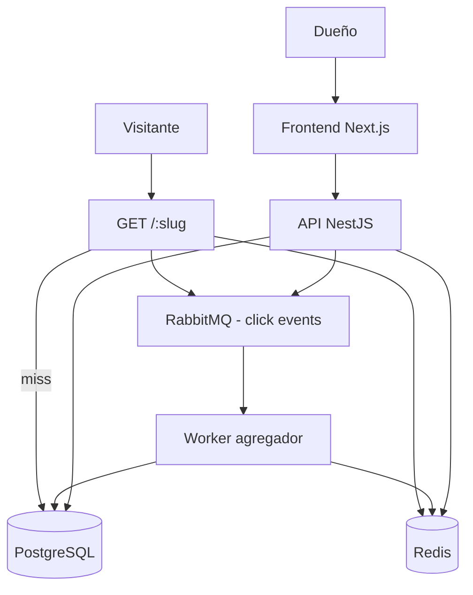

# LYNX — SPEC (URL Shortener con Analytics)

> **Qué:** sistema de acortado de URLs con analytics en tiempo real. Crea enlaces cortos únicos, redirige millones de visitas sin tocar la BD y agrega estadísticas de clics (total, por día, por país, por dispositivo) de forma asíncrona y sin pérdida de datos.
>
> **Para qué (CV):** demuestra **alta concurrencia de escritura** (generar slugs únicos sin colisiones), **altísimo throughput de lectura** (redirecciones servidas desde Redis), **integridad de datos** (contadores atómicos, deduplicación de eventos) y **asincronía** (agregación de analytics vía RabbitMQ). Es el clásico proyecto de sistemas llevado a nivel de empresa.

---

## 0. Casos de uso objetivo

1. **Crear enlace corto** — URL larga → slug corto (auto-generado o custom). Idempotente con `Idempotency-Key`.
2. **Redirigir** — `GET /:slug` → 308 permanente. Servido desde Redis (cache-aside), clic encolado de forma asíncrona.
3. **Ver analytics** — total de clics, desglose por día/país/device (agregados precomputados).
4. **Gestionar enlaces** — listar los míos, desactivar (invalidación inmediata de cache), eliminar.
5. **Generar QR** — imagen QR del enlace corto.

---

## 1. Stack tecnológico

| Capa | Tecnología |
| --- | --- |
| Backend | Node.js + TypeScript, **NestJS**, Prisma, zod |
| Frontend | **Next.js (App Router)**, React 19, Tailwind CSS |
| UI | shadcn/ui, lucide-react, next-themes, sonner, motion, recharts |
| Formularios | react-hook-form + zod |
| Datos | TanStack Query + Server Actions |
| BD | PostgreSQL (fuente de verdad) |
| Caché / rate limit | Redis |
| Mensajería | RabbitMQ (eventos de clic → worker agregador) |
| Auth | JWT (access + refresh) + GitHub OAuth |
| Observabilidad | Prometheus + Grafana, @nestjs/terminus, pino |
| QR | `qrcode` (backend) o librería client-side |
| Infraestructura | Docker + docker-compose |
| CI/CD | GitHub Actions |
| Testing | Jest, Supertest, test Postgres/Redis/RabbitMQ, Playwright, k6 |

---

## 2. Arquitectura



### 2.1 Estructura de carpetas (hexagonal)

```
src/
├── common/          # decorators, guards, filters, interceptors, exceptions
└── modules/
    ├── links/       # bounded context: enlaces (crear, gestionar, QR)
    │   ├── domain/           # Url, Slug, UrlFactory, LinkRepository (iface)
    │   ├── application/      # CreateLinkUseCase, DeactivateLinkUseCase, ListLinksUseCase
    │   ├── infrastructure/   # PrismaLinkRepository, RedisLinkCache
    │   └── interfaces/       # LinksController, DTOs
    ├── redirects/   # bounded context: redirección (alto throughput)
    │   ├── domain/           # RedirectService, ClickEvent
    │   ├── application/      # ResolveSlugUseCase, PublishClickUseCase
    │   ├── infrastructure/   # RedisLinkCache, RabbitClickPublisher
    │   └── interfaces/       # RedirectController
    ├── analytics/   # bounded context: agregación de clics
    │   ├── domain/           # DailyStats, ClickCounter
    │   ├── application/      # AggregateClicksWorker, GetStatsUseCase
    │   ├── infrastructure/   # ClickRepository, StatsProjection
    │   └── interfaces/       # AnalyticsController
    ├── auth/        # JWT + GitHub OAuth
    ├── users/       # perfil, owner
    ├── notifications/# emails (bienvenida, reporte) vía cola
    ├── audit/       # auditoría de acciones del dueño
    ├── health/
    └── metrics/
```

**Nota de escalado:** `redirects` es el módulo caliente. Diseñado para que, si algún día se extrae, su interfaz (slug → URL) y su evento (`Click`) ya están definidos.

---

## 3. Dominio (lenguaje ubicuo)

| Término | Definición |
| --- | --- |
| **Url** | Agregado raíz. Representa un enlace guardado: `originalUrl`, `slug`, `ownerId`, `isActive`, `createdAt`. |
| **Slug** | Value object. Código corto único (6–10 chars). Reglas: alfabeto `[a-zA-Z0-9_-]`, no ambiguo. |
| **ClickEvent** | Value object. Evento de dominio: `slug`, `ip`, `userAgent`, `country`, `device`, `timestamp`, `eventId` (uuid, para deduplicación). |
| **DailyStats** | Proyección de lectura. Agregado: `slug`, `day`, `totalClicks` (más desgloses opcionales por país/device). |
| **Owner** | Usuario dueño de los enlaces. La redirección es pública; la gestión requiere auth. |

### 3.1 Reglas de dominio

- El `slug` es **único global** (se permite custom, con reserva).
- `originalUrl` debe ser una URL válida y absolutamente calificada (https/http). Se rechaza acortar enlaces de LYNX (loop infinito).
- Un enlace **desactivado** no redirige (404) ni cuenta clics.
- La redirección **nunca bloquea** para registrar el clic (fire-and-forget + cola).

---

## 4. Casos de uso — flujos detallados

### 4.1 CU-1: Crear enlace corto

**Actor:** usuario autenticado (o anónimo si se decide habilitar público).

**Flujo principal:**
1. El usuario envía `originalUrl`, opcionalmente `customSlug`, y header `Idempotency-Key`.
2. Validar payload (zod): URL válida, `customSlug` (si llega) cumple regex y longitud.
3. Buscar por `Idempotency-Key`:
   - **Hit:** devolver el resultado original (200) sin crear nada.
4. Si hay `customSlug`: intentar insert con `ON CONFLICT (slug) DO NOTHING`:
   - **Insertado** → continuar.
   - **No insertado (conflicto)** → `409 Conflict` con mensaje "slug no disponible".
5. Si no hay `customSlug`: generar slug auto con `UrlFactory` (aleatorio con verificador de reservas), reintentando hasta éxito (backoff).
6. Insertar `Url` + emitir `DomainEvent` `LinkCreated` (outbox) para notificación/auditoría.
7. Poblar Redis: `lynx:url:{slug}` → `originalUrl` (sin TTL si es permanente, o TTL largo + refresh).
8. Responder `201 Created` con el recurso + `shortUrl` completa.

**Flujos alternativos / excepciones:**
- URL inválida → `400` con detalle RFC 7807.
- URL apunta a LYNX → `400`.
- Custom slug no disponible → `409`.
- No autenticado y endpoint privado → `401`.

**Código de estado:** `201` (nuevo) / `200` (idempotent hit) / `400` / `401` / `409` / `429`.

---

### 4.2 CU-2: Redirigir (núcleo de throughput)

**Actor:** visitante anónimo.

**Flujo principal:**
1. Llega `GET /:slug` (público, sin auth).
2. Rate limiting **por IP** (Redis): si excede, `429` con `Retry-After`.
3. Buscar en Redis `lynx:url:{slug}`:
   - **Hit activo** → ir a paso 5.
   - **Miss** → buscar en PostgreSQL (índice único por slug). Si existe, poblar Redis (Cache-Aside) → paso 5.
   - **No existe** → `404`.
   - **Existe pero `isActive=false`** → `404` (no revelar existencia).
4. *(opcional, para mayor seguridad)* verificar contra lista de slugs bloqueados (malware) antes de redirigir.
5. Publicar `ClickEvent` a RabbitMQ (cola `clicks`) — **asíncrono, nunca bloquea la respuesta**. El evento lleva `eventId` (uuid) y `slug`.
6. Responder `308 Permanent Redirect` con `Location: originalUrl` y header `Cache-Control: no-store` (evitar que proxies cachen clics) — o cachear la redirección solo para GET.

**Flujos alternativos / excepciones:**
- Slug inexistente/desactivado → `404`.
- Rate limit excedido → `429` + `Retry-After`.
- RabbitMQ caído → no bloquear la redirección: encolar en buffer local/log de respaldo (o descartar con métrica; decisión: **fail-open** para la redirección, se registra métrica `click_publish_errors`).

**Código de estado:** `308` (éxito) / `404` / `429`.

**Requisito de rendimiento:** la redirección debe servirse en **< 5 ms p95** desde Redis, sin tocar BD en el hot path. Documentado con test k6 (spike).

---

### 4.3 CU-3: Ver analytics

**Actor:** dueño del enlace (o admin).

**Flujo principal:**
1. `GET /links/:slug/stats?from=YYYY-MM-DD&to=YYYY-MM-DD&groupBy=day|country|device&page=&limit=`.
2. Auth + verificar que `slug` pertenece al usuario (o es admin).
3. Leer `DailyStats` agregados (tabla `daily_stats`, proyección) + total.
4. Desgloses (`groupBy`) desde agregados por dimensión (`stats_country`, `stats_device`) con paginación.
5. Cachear respuesta en Redis (TTL corto, p. ej. 60s) para evitar recálculos repetidos.
6. Responder JSON tipado (schemas en Swagger).

**Flujos alternativos / excepciones:**
- Slug no es tuyo → `403`.
- Sin datos → array vacío (estado empty en frontend).

**Código de estado:** `200` / `401` / `403` / `404`.

---

### 4.4 CU-4: Gestionar enlaces

**Actor:** dueño (o admin).

**Flujos:**
- `GET /links` — listar los míos (paginado, orden por `createdAt` desc, filtro por estado).
- `PATCH /links/:slug` — actualizar `originalUrl` (validar) o `isActive`.
- `DELETE /links/:slug` — eliminar.

**Puntos de integridad:**
- Al desactivar/eliminar: **invalidar Redis** (`DEL lynx:url:{slug}`) inmediatamente para que la redirección deje de servir.
- Al eliminar: los agregados de analytics se conservan (append-only) para auditoría, con referencia huérfana o marca `deleted_at`.

**Código de estado:** `200` / `204` / `401` / `403` / `404`.

---

### 4.5 CU-5: Generar QR

**Actor:** dueño.

**Flujo principal:**
1. `GET /links/:slug/qr` (o generación client-side en el frontend con la `shortUrl`).
2. Servir imagen PNG (con `qrcode`) o SVG; tamaño configurable; padding.
3. **Decisión:** el QR se genera en el frontend con `qrcode` (lib) a partir de la `shortUrl` — sin costo de servidor. Si se quiere persistir o en versión de alta resolución, endpoint backend con caché.

**Código de estado:** `200` (imagen) / `401` / `403` / `404`.

---

## 5. API Design (detallada)

Convenciones: base `/api/v1`, JSON, errores RFC 7807 (`type`, `title`, `status`, `detail`, `instance`), auth vía `Authorization: Bearer <accessToken>`, paginación con `?page=` + `?limit=` (default 20, máx 100), headers `X-Request-Id` (middleware) y `X-RateLimit-Remaining`.

### 5.1 Auth

| Método | Ruta | Auth | Rate limit | Body / Query | Respuesta 2xx | Errores |
| --- | --- | --- | --- | --- | --- | --- |
| POST | `/auth/register` | pública | 5/min/IP | `{name, email, password}` | `201 {user, accessToken, refreshToken}` | 400, 409 (email existe), 429 |
| POST | `/auth/login` | pública | 5/min/IP | `{email, password}` | `200 {user, accessToken, refreshToken}` | 400, 401, 429 |
| POST | `/auth/refresh` | pública | 10/min/IP | `{refreshToken}` | `200 {accessToken, refreshToken}` | 401 (reuso detectado → revocar cadena), 429 |
| POST | `/auth/logout` | Bearer | 10/min/user | `{refreshToken}` | `204` | 400, 401 |
| POST | `/auth/forgot-password` | pública | 1/min/IP | `{email}` | `202` (siempre, anti-enumeración) | 429 |
| POST | `/auth/reset-password` | pública | 1/min/IP | `{token, newPassword}` | `204` | 400, 401, 429 |
| GET | `/auth/oauth/github` | pública | 5/min/IP | — | `302 Location: github.com/login/oauth/...` | — |
| GET | `/auth/oauth/github/callback` | pública | 5/min/IP | `?code&state` | `302 → /dashboard` (setea cookies) | 400 (state inválido), 401 |

> **Nota:** `refreshToken` en register/login se añade en ticket #4 (refresh rotation). Ticket #3 emite solo `{user, accessToken}`.

### 5.2 Links

| Método | Ruta | Auth | Rate limit | Body / Query | Respuesta 2xx | Errores |
| --- | --- | --- | --- | --- | --- | --- |
| POST | `/links` | Bearer (o pública) | 10/min/user, 30/min/IP | `{originalUrl, customSlug?}` + header `Idempotency-Key` | `201/200 {id, slug, shortUrl, originalUrl, isActive, createdAt}` | 400, 401, 409 (slug), 422 (idempotency key sin resultado previo), 429 |
| GET | `/links` | Bearer | 60/min/user | `?page&limit&state=active\|inactive` | `200 {items[], page, total}` | 400, 401 |
| GET | `/links/:slug` | Bearer | 60/min/user | — | `200 {link}` | 401, 403, 404 |
| PATCH | `/links/:slug` | Bearer | 30/min/user | `{originalUrl?, isActive?}` | `200 {link}` | 400, 401, 403, 404, 429 |
| DELETE | `/links/:slug` | Bearer | 30/min/user | — | `204` | 401, 403, 404 |
| GET | `/links/:slug/stats` | Bearer | 30/min/user | `?from&to&groupBy=day\|country\|device&page&limit` | `200 {total, daily[]\|country[]\|device[], page}` | 400, 401, 403, 404 |
| GET | `/links/:slug/qr` | Bearer | 30/min/user | `?size=256` | `200 image/png` | 401, 403, 404 |

### 5.3 Redirección (pública)

| Método | Ruta | Auth | Rate limit | Respuesta 2xx | Errores |
| --- | --- | --- | --- | --- | --- |
| GET | `/:slug` | pública | 60/min/IP (configurable) | `308` + `Location` | 404, 429 |

### 5.4 Sistema

| Método | Ruta | Auth | Descripción |
| --- | --- | --- | --- |
| GET | `/health` | pública | estado de Postgres, Redis, RabbitMQ |
| GET | `/metrics` | pública (o protegida) | Prometheus |
| GET | `/audit-logs` | ADMIN | logs de auditoría paginados |

### 5.5 Ejemplo de request/response

**POST /links** (con Idempotency-Key):
```http
POST /api/v1/links
Authorization: Bearer <token>
Idempotency-Key: 550e8400-e29b-41d4-a716-446655440000
Content-Type: application/json

{ "originalUrl": "https://www.example.com/blog/arquitectura-hexagonal", "customSlug": "hexa" }
```
```json
201 Created
{
  "id": "clx9...",
  "slug": "hexa",
  "shortUrl": "https://lynx.dev/hexa",
  "originalUrl": "https://www.example.com/blog/arquitectura-hexagonal",
  "isActive": true,
  "createdAt": "2026-08-09T10:00:00Z"
}
```

**Error (slug ocupado):**
```json
409 Conflict
{
  "type": "https://lynx.dev/errors/slug-not-available",
  "title": "Slug no disponible",
  "status": 409,
  "detail": "El slug 'hexa' ya está en uso.",
  "instance": "/api/v1/links"
}
```

---

## 6. Database Design

### 6.1 Tablas

```sql
-- usuarios (igual que la template: roles, oauth_accounts, refresh_tokens, audit_logs)

CREATE TABLE urls (
    id            UUID PRIMARY KEY DEFAULT gen_random_uuid(),
    owner_id      UUID REFERENCES users(id),          -- NULL = anónimo si se habilita
    original_url  TEXT NOT NULL,
    slug          VARCHAR(16) NOT NULL UNIQUE,        -- UNIQUE = integridad de unicidad
    is_active     BOOLEAN NOT NULL DEFAULT true,
    created_at    TIMESTAMPTZ NOT NULL DEFAULT now(),
    updated_at    TIMESTAMPTZ NOT NULL DEFAULT now()
);

-- La UNIQUE en slug es la red de seguridad final de concurrencia;
-- el INSERT ... ON CONFLICT DO NOTHING es la vía normal de creación.

CREATE TABLE clicks (
    id          BIGSERIAL PRIMARY KEY,
    url_id      UUID NOT NULL REFERENCES urls(id) ON DELETE CASCADE,
    event_id    UUID NOT NULL UNIQUE,                 -- deduplicación del worker
    ip          INET,
    country     VARCHAR(2),                           -- geolocalización (maxmind/geoip)
    device      VARCHAR(20),                          -- mobile | desktop | tablet | bot
    user_agent  TEXT,
    occurred_at TIMESTAMPTZ NOT NULL
);

-- Proyecciones agregadas (append-only, recalculables)
CREATE TABLE daily_stats (
    url_id   UUID NOT NULL REFERENCES urls(id),
    day      DATE NOT NULL,
    clicks   BIGINT NOT NULL DEFAULT 0,
    PRIMARY KEY (url_id, day)
);

CREATE TABLE stats_country (
    url_id   UUID NOT NULL REFERENCES urls(id),
    day      DATE NOT NULL,
    country  VARCHAR(2) NOT NULL,
    clicks   BIGINT NOT NULL DEFAULT 0,
    PRIMARY KEY (url_id, day, country)
);

CREATE TABLE stats_device (
    url_id   UUID NOT NULL REFERENCES urls(id),
    day      DATE NOT NULL,
    device   VARCHAR(20) NOT NULL,
    clicks   BIGINT NOT NULL DEFAULT 0,
    PRIMARY KEY (url_id, day, device)
);

CREATE INDEX idx_clicks_url_occurred ON clicks(url_id, occurred_at DESC);
CREATE INDEX idx_daily_stats_url ON daily_stats(url_id, day DESC);
```

### 6.2 Diseño de concurrencia e integridad

- **Unicidad del slug:** constraint `UNIQUE` en BD + `INSERT ON CONFLICT DO NOTHING` + reintentos con backoff para auto-generados. Bajo N concurrentes pidiendo el mismo custom slug, solo uno gana; los demás reciben `409`.
- **Contadores sin pérdida (agregación):** el worker hace **upsert atómico**:
  ```sql
  INSERT INTO daily_stats (url_id, day, clicks) VALUES ($1, $2, 1)
  ON CONFLICT (url_id, day)
  DO UPDATE SET clicks = daily_stats.clicks + 1;
  ```
  Nunca se lee-modifica-escribe (`SELECT +1 UPDATE`), que pierde updates bajo concurrencia.
- **Deduplicación de eventos:** `clicks.event_id UNIQUE`. El worker ignora inserts duplicados (`ON CONFLICT DO NOTHING`). Un mismo mensaje de RabbitMQ entregado dos veces (retry) cuenta una sola vez.
- **Hot link:** si un enlace explota en clics, se puede agregar en Redis (`HINCRBY lynx:clicks:{slug}:{day}`) y volcar a Postgres en batch. Es un *concepto avanzado opcional* documentado en ADR.

### 6.3 Redis keys

| Clave | Valor | TTL | Uso |
| --- | --- | --- | --- |
| `lynx:url:{slug}` | `originalUrl` (o flag `inactive`) | sin TTL / 24h + refresh | redirección (cache-aside) |
| `lynx:rate:ip:{ip}` | contador | ventana | rate limit IP |
| `lynx:rate:user:{userId}` | contador | ventana | rate limit usuario |
| `lynx:jwt:blacklist:{jti}` | `1` | hasta expiración del token | revocación JWT |
| `lynx:stats:{slug}:{day}:{dim}` | contador | 24h | agregación prevuelta (opcional) |

---

## 7. Mensajería (RabbitMQ)

### 7.1 Flujo del clic

```
RedirectController → (publish) exchange 'clicks' → queue 'clicks.ingest' → [Worker agregador]
Worker: validar eventId → upsert clicks → upsert daily_stats/country/device → ack
Fallos transitorios → requeue (n≤3, backoff exponencial)
Fallos persistentes → DLQ 'clicks.dlq' (inspección/reproceso manual)
```

- Cola `clicks.ingest`: `prefetch: 1`, acks manuales, `durable: true`.
- Mensaje de ejemplo:
  ```json
  {
    "eventId": "550e8400-e29b-41d4-a716-446655440000",
    "slug": "hexa",
    "ip": "203.0.113.7",
    "userAgent": "Mozilla/5.0 ...",
    "country": "MX",
    "device": "desktop",
    "occurredAt": "2026-08-09T10:05:12Z"
  }
  ```

### 7.2 Otras colas

- `emails.welcome` — email de bienvenida al registrarse (producer: auth; consumer: notifications).
- `emails.reset` — reset de contraseña.
- `links.created` / `links.deactivated` — eventos de dominio para auditoría y (opcional) feeds/notificaciones.

---

## 8. Observabilidad (métricas clave)

| Métrica | Tipo | Descripción |
| --- | --- | --- |
| `lynx_redirect_total{slug,status}` | Counter | redirecciones servidas por estado |
| `lynx_redirect_latency_seconds` | Histogram | latencia de redirección (p50/p95/p99) |
| `lynx_cache_hit_total` / `miss_total` | Counter | hit ratio de Redis en redirección |
| `lynx_click_published_total` | Counter | eventos publicados a la cola |
| `lynx_click_publish_errors_total` | Counter | fallos de publicación (fail-open) |
| `lynx_click_processed_total` | Counter | eventos agregados por el worker |
| `lynx_click_dlq_total` | Counter | eventos que cayeron a DLQ |
| `http_request_duration_seconds` | Histogram | latencia por ruta (Nest Prometheus) |

**Grafana:** dashboard con panels de throughput de redirección, hit ratio de caché, backlog de la cola `clicks.ingest` y error rate del worker.

---

## 9. Frontend (Next.js, estilo Vercel)

### 9.1 Rutas

| Ruta | Página |
| --- | --- |
| `/` | Landing + hero con demo de crear enlace |
| `/login` | Login + "Continuar con GitHub" |
| `/register` | Registro |
| `/dashboard` | Lista de mis enlaces (tabla limpia: slug, URL, clics, estado, acciones) |
| `/dashboard/new` | Formulario de creación (originalUrl + customSlug opcional + toggle) |
| `/dashboard/links/[slug]` | Detalle + analytics (totales + gráficas de clics por día/país/device con recharts) |
| `/dashboard/links/[slug]/qr` | Modal/página QR descargable |

### 9.2 Components por feature

- `features/links`: `LinkTable`, `CreateLinkForm`, `LinkCard`, `SlugInput` (live-availability), `QrButton`.
- `features/analytics`: `StatsOverview`, `ClicksByDayChart` (recharts), `ClicksByCountry`, `ClicksByDevice`, `DateRangePicker`.
- `features/auth`: `LoginForm`, `RegisterForm`, `GithubButton`.

### 9.3 Data fetching

- Server Actions para mutaciones (`createLink`, `toggleLink`, `deleteLink`) con revalidación (`revalidatePath('/dashboard')`).
- TanStack Query para stats interactivos (cambiar rango de fechas sin recargar).
- `middleware.ts` protege `/dashboard*` redirigiendo a `/login` si no hay sesión.

### 9.4 Estilo

- Paleta neutral (white / zinc-950), acento violeta sutil en CTA y hover.
- Geist Sans para UI; Geist Mono para slugs, URLs y IDs.
- Empty states ("Aún no tienes enlaces — crea el primero"), skeletons en carga, toasts con sonner al crear/eliminar.
- Tabla de enlaces con copiar `shortUrl` al click.

---

## 10. Casos de prueba por caso de uso

### CU-1 Crear enlace

**Unit (dominio):**
- `Slug` valida formato y longitud; rechaza caracteres inválidos y palabras reservadas.
- `UrlFactory.generate()` produce slugs únicos dentro de un alfabeto y sin colisiones simuladas (mock del repositorio).
- Regla: rechaza `originalUrl` que apunte al propio dominio LYNX.

**Integración:**
- POST `/links` con `customSlug` libre → `201`, persistido en BD y presente en Redis.
- POST con `customSlug` ocupado → `409`; BD no se duplica.
- **Concurrencia:** 20 requests paralelas con el **mismo** `customSlug` → exactamente **1 éxito (201)** y **19 `409`**.
- POST con `Idempotency-Key` repetida → mismo resultado (200), **1 solo** registro en BD.
- URL inválida → `400` con RFC 7807.
- Sin token en endpoint privado → `401`.

**E2E (Playwright):**
- Login → crear enlace → aparece en la lista con su shortUrl y QR.

**Carga (k6):**
- 500 creaciones concurrentes de slugs auto → 0 colisiones, latencia p95 < 200ms.

### CU-2 Redirigir

**Unit:**
- `ResolveSlugUseCase` devuelve `originalUrl` desde cache; en miss, consulta repositorio y puebla cache.
- Enlace inactivo → resuelve a "no encontrado".
- `PublishClickUseCase` construye `ClickEvent` con `eventId` uuid.

**Integración:**
- GET `/:slug` existente → `308` con `Location` correcta; Redis poblado (miss posterior no toca BD — verificar con spy).
- GET slug inexistente → `404`.
- GET slug inactivo → `404`.
- **Concurrencia/cache:** 50 GET simultáneos al mismo slug recién creado → todos `308`, BD consultada 1 sola vez (una sola populating).
- **Fail-open:** con RabbitMQ apagado, GET sigue devolviendo `308` y la métrica `click_publish_errors` sube.
- Rate limit por IP excedido → `429` + header `Retry-After`.

**E2E:**
- Crear enlace desde la web, navegar a `shortUrl` en pestaña nueva → aterriza en la URL original.

**Carga (k6):**
- **Spike:** 10k redirecciones en 1 min contra slugs cacheados → p95 < 5ms, 0 errores, backlog de cola consumido después.
- Verificar que `daily_stats` al final es consistente con los clics encolados (sin pérdida).

### CU-3 Analytics

**Unit:**
- `GetStatsUseCase` mapea rango de fechas y `groupBy`; aplica paginación.
- La proyección devuelve total calculado de filas `daily_stats`.

**Integración:**
- Insertar clicks simulados en 3 días distintos + worker → `GET stats` devuelve total y desglose por día correctos.
- `groupBy=country` devuelve conteos por país.
- Enlace ajeno → `403`; enlace inexistente → `404`.
- Respuesta cacheada en Redis (segunda llamada no recalcula — spy en repositorio).

**E2E:**
- En el detalle del enlace, el gráfico por día refleja los clics del periodo seleccionado.

**Carga:**
- Consulta de stats sobre un enlace con 1M de clics → < 300ms (índices + proyecciones).

### CU-4 Gestionar

**Integración:**
- PATCH `isActive=false` → Redis invalidado (`DEL`), GET `/:slug` → `404` inmediatamente.
- PATCH `originalUrl` → cache invalidado y nueva redirección sirve la URL nueva.
- DELETE → `204`, registro borrado, analytics conservados (append-only).
- Lista con paginación devuelve solo los del owner; admin ve todos (opcional).

**E2E:**
- Desactivar un enlace desde el dashboard → al abrir shortUrl da error de enlace no encontrado.

### CU-5 QR

**Unit:**
- Generación de QR a partir de `shortUrl` produce un PNG decodificable (librería `qrcode`).

**E2E:**
- Desde el detalle, descargar/ver QR y escanear con lector de prueba → navega a `shortUrl`.

---

## 11. Fases de implementación

### Fase 1 — Foundation
1. Bootstrap monorepo + config tipada.
2. PostgreSQL + migraciones (`users`, `roles`, `urls`).
3. Auth JWT + RBAC + GitHub OAuth.
4. CU-1 crear enlace (incl. concurrencia de slug + idempotencia).
5. CU-2 redirigir (Redis cache-aside).
6. Rate limiting + health + Swagger.
7. Docker Compose.

### Fase 2 — Async & Observability
8. RabbitMQ: eventos de clic + worker agregador + DLQ.
9. CU-3 analytics (proyecciones).
10. Emails (bienvenida, reset) vía cola.
11. Audit logs.
12. Prometheus + Grafana.

### Fase 3 — Polish
13. CU-4 gestionar (UI de dashboard completa).
14. CU-5 QR.
15. Tests de carga k6 (spike) + documentación del escenario de concurrencia.
16. Seed + Postman collection.
17. README con diagrama, screenshots y cómo levantar.

---

## 12. Criterios de éxito

> "Construí LYNX: un acortador de URLs con analytics. Genera slugs únicos bajo alta concurrencia, sirve millones de redirecciones desde Redis en < 5ms sin tocar la BD, y agrega clics de forma asíncrona con RabbitMQ sin perder ni duplicar datos gracias a idempotencia y deduplicación."

**Proof points:**
- Test de concurrencia: N requests con el mismo custom slug → 1 éxito.
- Test de idempotencia: request duplicado no crea enlace doble.
- k6 spike de redirecciones con hit ratio de cache y sin pérdida de clics.
- DLQ operativa (fallo del worker no pierde clics).
- Grafana mostrando throughput, hit ratio y backlog de cola.
- Un comando levanta todo.

---

## 13. README requirements

- Descripción + diagrama de arquitectura.
- Lista de features con demo/gif.
- Stack.
- `docker compose up` + variables de entorno (`.env.example`).
- Link a Swagger.
- Screenshots: dashboard, redirección (308), rate limit (429), Grafana.
- Sección "mejoras futuras" (Hot links, geolocalización real, purga de clicks antiguos, multi-tenant).

---

## 14. Checklist final

- [ ] Un comando levanta todo.
- [ ] Slug único bajo concurrencia demostrado con test.
- [ ] Redirección desde Redis sin BD en hot path.
- [ ] Clics agregados con deduplicación y DLQ.
- [ ] Analytics por día/país/device.
- [ ] GitHub OAuth + JWT con rotación de refresh.
- [ ] Rate limiting con 429 + Retry-After.
- [ ] Métricas + Grafana.
- [ ] Frontend estilo Vercel con shadcn/ui.
- [ ] Tests unit/integración/e2e/carga.
- [ ] CI/CD + README.
